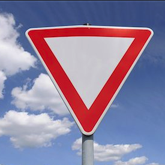
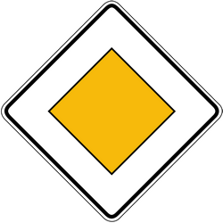
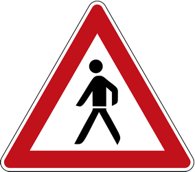
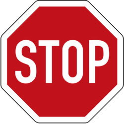
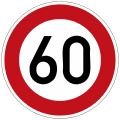

# **Traffic Sign Recognition** 

The goals / steps of this project are the following:
* Load the data set
* Explore, summarize and visualize the data set
* Design, train and test a model architecture
* Use the model to make predictions on new images
* Analyze the softmax probabilities of the new images

[//]: # (Image References)

[image1]: ./examples/random1.png "Visualization"
[image2]: ./examples/hist.png "Histogram"
[image3]: ./examples/pre.png "Preprocessed"
[image4]: ./examples/webload.png "Sample Images Resized"
[image5]: ./examples/webpred.png "Prediction 1"
[image6]: ./examples/webpred1.png "Prediction 2"
[image7]: ./examples/webpred2.png "Prediction 3"
[image8]: ./examples/webpred3.png "Prediction 4"
[image9]: ./examples/webpred4.png "Prediction 5"
[image10]: ./examples/websoft.png "Softmax Color 1"
[image11]: ./examples/websoft1.png "Softmax Color 2"
[image12]: ./examples/websoft2.png "Softmax Color 3"
[image13]: ./examples/websoft3.png "Softmax Color 4"
[image14]: ./examples/websoft4.png "Softmax Color 5"
[image15]: ./examples/download1.png "Softmax Gray 1"
[image16]: ./examples/download2.png "Softmax Gray 2"
[image17]: ./examples/download3.png "Softmax Gray 3"
[image18]: ./examples/download4.png "Softmax Gray 4"
[image19]: ./examples/download5.png "Softmax Gray 5"
[image20]: ./examples/visual.png "NN State"

### Data Set Summary & Exploration

#### 1. Read and loaded data from the pickle files. Explored data using python libraries.

Loaded the training data into *X_train* and *y_train*. Similar operation for the validation and test data. 

Used *X_train.shape[0]* to get the total number of training data. 

Used *X_train[0].shape* to get the shape of first image in the training data.

Used *np.unique* with *shape()* to get the total number of unique classes.

Read data from *signnames.csv* to populate all the class names into labels list.

Imported *numpy* and *csv* to achieve the above.

* The size of training set is = 34799
* The size of the validation set is = 4410
* The size of test set is = 12630
* The shape of a traffic sign image is = (32, 32, 3)
* The number of unique classes/labels in the data set is = 43

#### 2. Visualization of the dataset.

Randomly selected 5 images from the training data and used subplot to visualize them. Imported *matplotlib.pyplot* and *random* for this purpose.

![alt text][image1]

Plotted a histogram to indicate label distribution in training and testing data. Set bin from 0 to 42 for 43 classes. This plot gives a good idea of how the labels are spread out in the datasets. 

![alt text][image2]

### Design and Test a Model Architecture

#### 1. Preprocessing the image data

The first step was to convert the images to grayscale. Imported *cv2* and used *cv2.cvtColor(i, cv2.COLOR_BGR2GRAY)* to convert the image. Then *np.expand_dims* is required to adjust the dimensions. Then append all the grayscale images. I believe this is important as colours are not a consideration for the traffic symbols. The grayscale images would give out lines and edges better. 

I could not find an increase in accuracy on using grayscale images in the final results. Actually the color images gave a little more accuracy. Mentioned later in the write up about the softmax probabilities for the grayscale and color images.

The next step was to normalize the images hoping for better accuracy and it did not disappoint me. I was satisfied with this addition.

The *preprocess* function takes in images and labels, performs the above functions, shuffles the data using *shuffle* from *sklearn.utils* and return the data back. 

Then visualize the shapes of the dataset and the ramdomly selected images after the preprocessing stage.

* Preprocessed training data shape (34799, 32, 32, 3)
* Preprocessed validation data shape (4410, 32, 32, 3)
* Preprocessed test data shape (12630, 32, 32, 3)

![alt text][image3]

#### 2. Final model architecture

Used the LeNet model from the previous project. The initial grayscale model did not require any changes to the input as the image shape was 32x32x1. The fully connected layer 3 was changed to output 43 classes from the previous 10 classes.

After I changed to using color images the shape changed to 32x32x3 so I changed the shape of the weights to *(5, 5, 3, 6)*. The output will remain at 43. Similarly the placeholder x has to be changed to *(None, 32, 32, 3)* and the one hot encoded y to *(y, 43)*.

My final model consisted of the following layers:

| Layer         		|     Description	        					| 
|:---------------------:|:---------------------------------------------:| 
| Input         		| 32x32x3 RGB image   							| 
| Convolution 1     	| 1x1 stride, valid padding, outputs 28x28x6 	|
| RELU					|												|
| Max pooling	      	| 2x2 stride, valid padding, outputs 14x14x6	|
| Convolution 2     	| 1x1 stride, valid padding, outputs 10x10x16 	|
| RELU					|												|
| Max pooling	      	| 2x2 stride, valid padding, outputs 5x5x16 	|
| Flatten				| outputs 400									|
| Fully connected 1		| outputs 120									|
| RELU					|												|
| Fully connected 2		| outputs 84									|
| RELU					|												|
| Fully connected 3		| outputs 43									|
|						|												|

#### 3. Training my model

The training pipeline has 5 steps to compute
* Logits by applying the dataset to the LeNet architecture
* Cross Entropy using the softmax_cross_entropy_with_logits function
* Use reduce_mean function to apply mean across all the elements 
* Adam Optimizer uses the learning rate provided to give the optimizer value
* The minimize function returns the final training result

The following are the different parameters that were tried on the model.
* Batch size -> 256 -> 128 (final)
* Number of epochs -> 10 -> 1000 -> 100 (final) 
* Learning rate -> 0.1 -> 0.0001 -> 0.001 (final)

#### 4. Finding a solution and getting the validation set accuracy to be at least 0.93

The table shows last 10 epochs of validation accuracy between color and grayscale image data

| Epoch Number          | Color          | Grayscale          | 
|:---------------------:|:--------------:|:------------------:| 
| 91             		| 95.1%          | 94.4%              |
| 92             		| 93.9%          | 94.4%              |
| 93             		| 93.9%          | 94.3%              |
| 94             		| 94.6%          | 94.3%              |
| 95             		| 94.6%          | 94.4%              |
| 96             		| 94.6%          | 94.4%              |
| 97             		| 94.6%          | 94.4%              |
| 98             		| 94.6%          | 94.4%              |
| 99             		| 94.6%          | 94.4%              |
| 100             		| 94.6%          | 94.3%              |

Adding a dropout layer did not result in any significant increase in the accuracy.

My final model results were:
* validation set accuracy of 94.6%
* test set accuracy of 94.6%

### Test a Model on New Images

#### 1. Five German traffic signs found on the web

The dimensions of the sample images are 
(275, 275, 3)
(250, 250, 3)
(250, 284, 3)
(250, 250, 3)
(120, 120, 3)

Dimension of the image after resizing is 
(32, 32, 3)

![alt text][image4]

I selected the images so that it really confuses and challenges the model. The yield sign should be a clear winner as the model should recognize the triangle clearly.

The 60km/h speed limit sign could result in some confusion as well because there are atleast 8 speed limit signs. All of them are in a circle with the difference being the number inside.

The pedestrian and priority road signs might be a challenge as they are primarily of triangle shape and much value might be given to the person inside the sign. Fingers crossed with the stop sign as its tough to imagine how the model would vsualize it.

#### 2. Model's predictions on these new traffic signs

Here are the results of the prediction:

Preprocessed sample data shape (5, 32, 32, 3)

![alt text][image5]![alt text][image6]![alt text][image7]![alt text][image8]![alt text][image9]

As expected the signs are pretty challenging for the trained model. Only 2 out of 5 signs were correctly predicted. The test accuracy is 40%. It would help to check how the top 5 probabilities were for each of these images to understand the prediction. 

#### 3. Top 5 softmax probabilities for each image

There are a number of reasons for these results.
* The yield sign has one of the highest number of samples in the dataset. Hence it is not surprising to get the best prediction.
* The pedestrian sign on the other hand hardly has any data in the dataset and looks very similar to the yield sign and right-of-way sign. 
* The 60km/hr speed sign is perfectly predicted because of the availability of huge number and variety of speed signs data.
* More preprocessing techniques should be added to the images. Adding more data alone would not be enough.

The top five soft max probabilities were

| Color images input            | Grayscale images input        | 
|:-----------------------------:|:-----------------------------:| 
| ![alt text][image10]          | ![alt text][image17]          |
| ![alt text][image11]          | ![alt text][image15]          |
| ![alt text][image12]          | ![alt text][image16]          |
| ![alt text][image13]          | ![alt text][image19]          |
| ![alt text][image14]          | ![alt text][image18]          |
